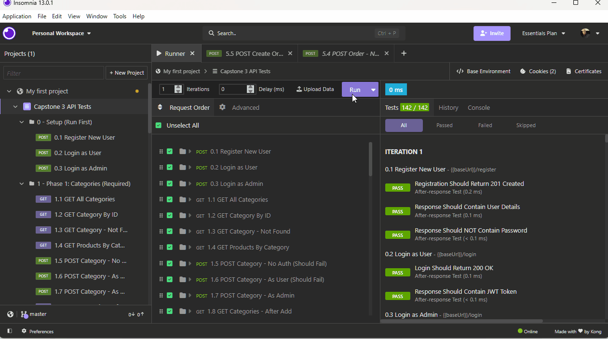
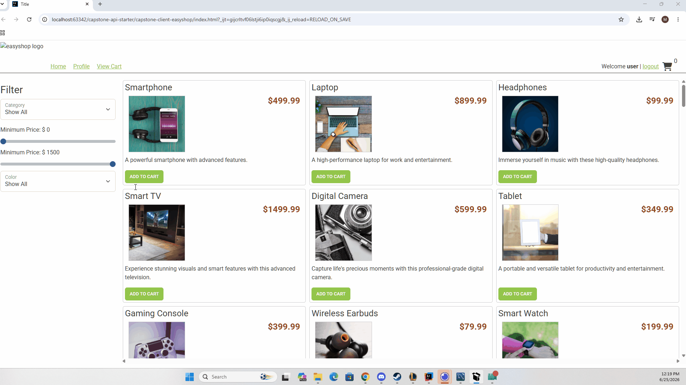
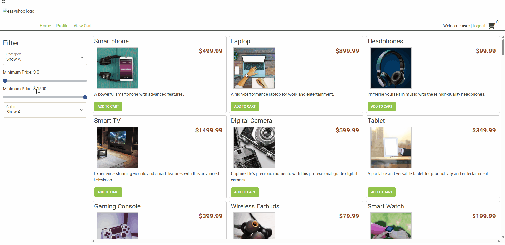
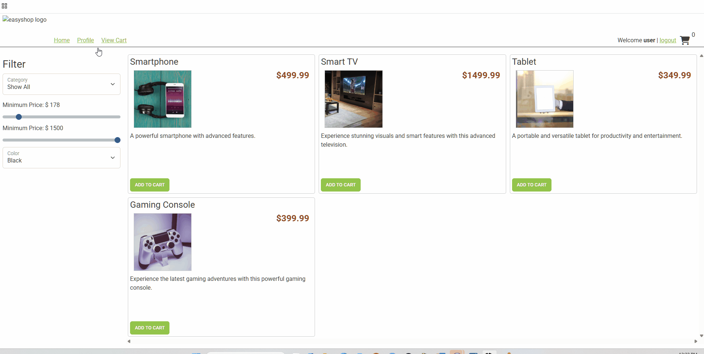

# Easy Shop

## Description of the Project

This application is a full-stack e-commerce web application that allows users to browse a catalog of products with filtering options to make finding items quick and easy. Registered users can add products to a shopping cart, remove items, and complete the checkout process to place orders. Users can also create and update a personal profile, which is used to store shipping information and manage their shopping experience. The application provides a complete online shopping workflow, from browsing products to placing an order.

## User Stories

- As a user I want to search by category ID this way its easier to find product
- As user i want to search products by category this way i can see grouped product
- As i user i want to be able to update my profile so that way i can make changes if i made a mistake or something changes
- As a user I want to be able to add multiple things to my cart this way i can check out with everything i want
- As a user I want to be able to check out and leave with my items this way i can take what i want with me

### Prerequisites

- Java 17 or later
- IntelliJ IDEA (or another Java IDE)
- MySQL Server
- Maven
- Git (optional)

### Installation

1. Clone the repository:
   ```bash
   git clone <repository-url>
   ```

2. Open the project in IntelliJ IDEA.

3. Create a MySQL database for the application.

4. Update the database connection settings in the `application.properties` file:

   ```properties
   spring.datasource.url=jdbc:mysql://localhost:3306/<database_name>
   spring.datasource.username=<your_username>
   spring.datasource.password=<your_password>
   ```

5. Allow Maven to download all required dependencies.

6. Run the application from the main Spring Boot class.

### Prerequisites

Before running the application, ensure you have the following installed:

- **IntelliJ IDEA** – Download and install the latest version from the [JetBrains website](https://www.jetbrains.com/idea/download/).
- **Java 17 SDK** (or the version required by the project) – Make sure the JDK is installed and configured in IntelliJ IDEA.
- **MySQL Server** – Install and configure a local MySQL instance to host the application's database.
- **Maven** – Used to manage project dependencies (included with IntelliJ by default).
- **Git** (Optional) – Required if you plan to clone the repository from GitHub.
- 
### Running the Application in IntelliJ

Follow these steps to run the application in IntelliJ IDEA:

1. Open IntelliJ IDEA.
2. Select **Open** and choose the project folder.
3. Allow IntelliJ to import the Maven project and download all required dependencies.
4. Verify that your MySQL server is running and that the database connection settings in `application.properties` are configured correctly.
5. Locate the main Spring Boot application class (the ECommerceApplication class containing the `main` method and `@SpringBootApplication` annotation).
6. Right-click the application class and select **Run**.

## Technologies Used

- **Java 17**
- **Spring Boot**
- **Spring Web** – REST API development
- **Spring Security** – User authentication and authorization
- **Spring Data JPA** – Database access and ORM
- **MySQL** – Relational database
- **JUnit 6** – Unit testing
- **Mockito** – Mocking framework for unit tests
- **Git & GitHub** – Version control and source code management

## Demo






## Future Work

Potential enhancements for future versions of this application include:

- Add product reviews and ratings to allow customers to share feedback and improve purchasing decisions.
- Implement an order history page where users can view previous purchases and reorder items.
- Improve search functionality with keyword searching, sorting, and additional filtering options.
- Add inventory management to automatically update stock levels after purchases.
- Expand unit and integration test coverage to improve reliability and maintainability.

## Resources

The following resources were used throughout the development of this project:

- Spring Boot Official Documentation – https://docs.spring.io/spring-boot/reference/ 
- Spring Framework Documentation – https://docs.spring.io/spring-framework/reference/ 
- Course materials and instructor-provided examples from the Year Up Java Development program.

## Team Members

- Mason Jopson - All Project code

## Thanks

Express gratitude towards those who provided help, guidance, or resources:

- Thank you to Raymond and my classmates that helped me navigate things
 